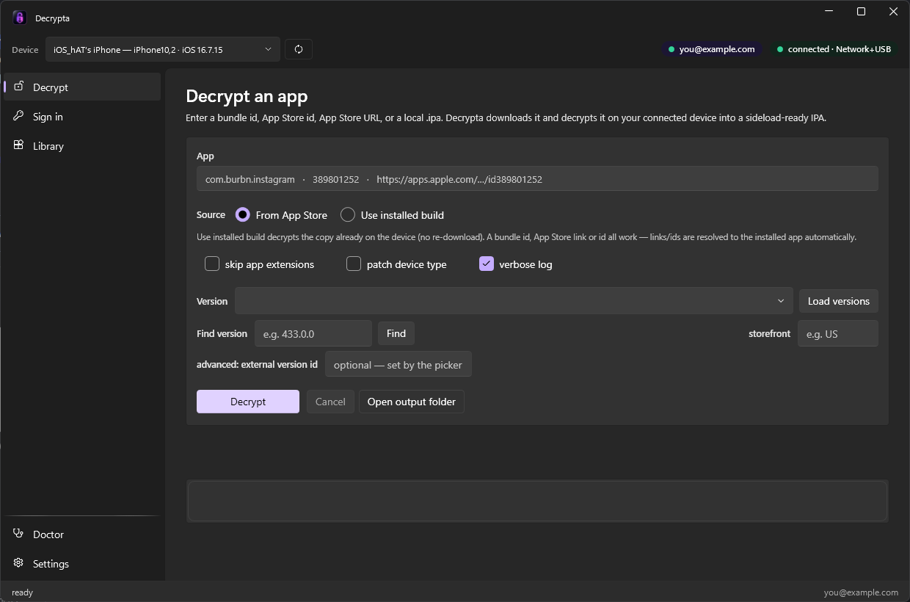
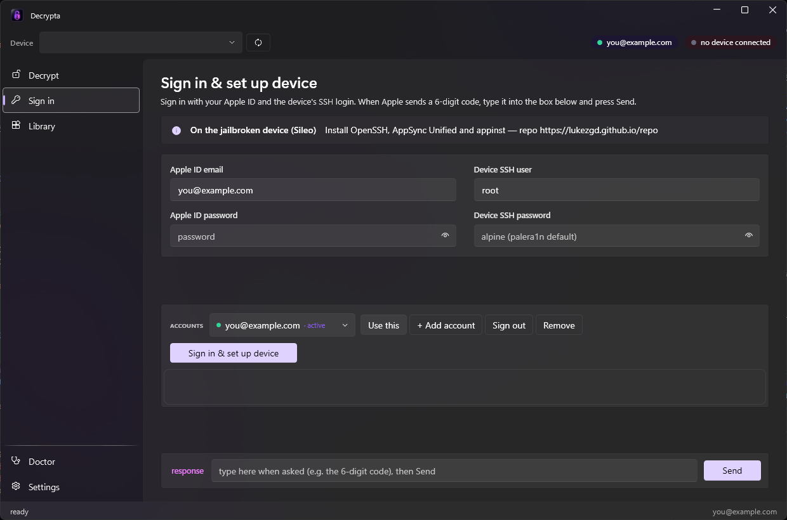
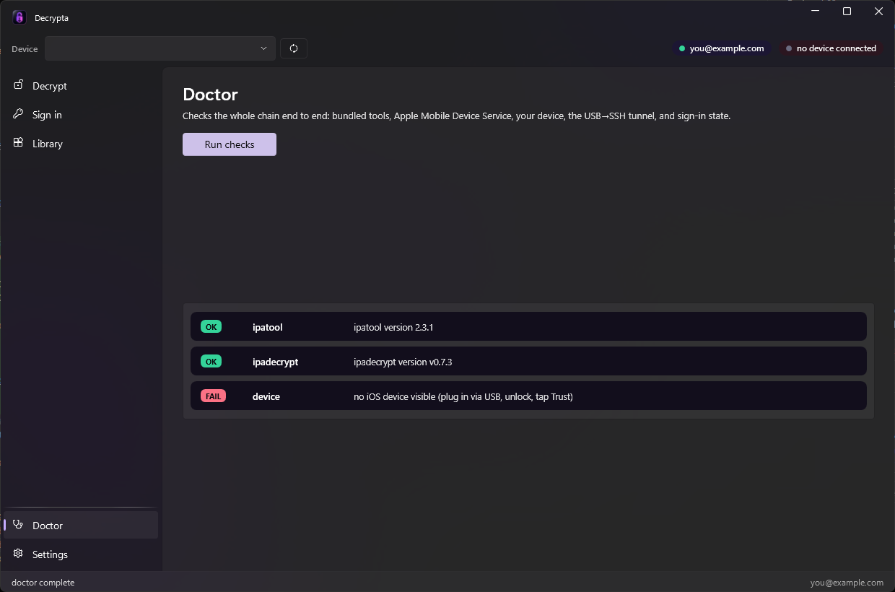

<div align="center">


# Decrypta

**Download App Store apps and decrypt them into sideload-ready IPAs — on Windows.**

No macOS. No WSL. Just your PC and a jailbroken iPhone/iPad — connected over USB or Wi-Fi.

[](https://github.com/pwnapplehat/Decrypta/releases/latest)

[](https://github.com/pwnapplehat/Decrypta/actions/workflows/ci.yml)
[](https://github.com/pwnapplehat/Decrypta/releases/latest)
[](LICENSE)
[](https://dotnet.microsoft.com/)
[](#requirements)



</div>

---

Decrypta is a native Windows desktop app. You give it a bundle id, App Store id, App
Store URL, or a local `.ipa`; it signs in to the App Store, downloads the app, and
decrypts it on your connected device into a clean, installable IPA — then hands it to your
Library ready for TrollStore / Sideloadly / etc.

## Why a device is required (and why WSL can't help)

App Store binaries are wrapped in Apple **FairPlay DRM**. The content key is bound to
Apple's **Secure Enclave**, so only the Apple kernel can decrypt the binary, at app-load,
on genuine Apple silicon. There is no software-only FairPlay decrypter on any OS, and WSL
(a Linux VM on x86) has no Apple kernel and no Secure Enclave, so it cannot decrypt either.

Decrypta does **100% of the orchestration on Windows** and uses your jailbroken device
purely as the decryption engine — you never touch the phone manually. It talks to the
device through usbmuxd, so it works over the **USB cable or Wi-Fi** (a network-paired
device) transparently.

```
 Windows (Decrypta.exe, native .NET)                 iPhone / iPad (jailbroken)
 ───────────────────────────────────                 ──────────────────────────
 App Store sign-in + download  ── ipadecrypt ──▶ Apple
 Version history (reuses session) ── Decrypta ─▶ Apple (StoreKit)
 usbmux TCP tunnel  127.0.0.1 ────USB / Wi-Fi──▶ device :22 (OpenSSH)
 ipadecrypt over SSH/SFTP  ─────────────────────▶ on-device helper
                                                   (task_for_pid + mach_vm_read →
                                                    FairPlay plaintext)
 ◀──── decrypted, cryptid-patched, repackaged .ipa ────  saved to your Library
```

## What it does

| | |
|---|---|
| **Decrypt** | Give it a bundle id, App Store id, App Store URL, or a local `.ipa`. Decrypta authenticates, downloads the encrypted package, decrypts it on your device, patches `cryptid`, repackages it, and drops a sideload-ready IPA in your Library. Choose *From App Store* (latest) or *Use installed build*, **click _Load versions_ to pick any older App Store build from a dropdown** (version number + release date), skip app extensions, or patch the device family. |
| **Sign in** | One-time Apple ID sign-in with **2FA handled in-app** — when Apple sends the 6-digit code you type it into the console and press Send. Device SSH login (palera1n's `root` / `alpine` by default) is set up in the same step; the USB/Wi-Fi tunnel is wired automatically, so you never enter an IP. **Multiple Apple IDs** are supported — add/switch/remove accounts (each isolated), with a clear signed-in indicator in the header. |
| **Library** | Every decrypted IPA you've produced, newest first, with size and reveal-in-Explorer. Pick the **output folder** here or in Settings; the encrypted-download **cache is kept inside that folder** (nothing in system temp) and a one-click **Clean** wipes cached/partial downloads completely — a failed or cancelled decrypt never leaves anything behind. |
| **Doctor** | One-click end-to-end health check: bundled tools, Apple Mobile Device Service, your connected device, the SSH tunnel (shows the live OpenSSH banner), and sign-in state. |
| **Auto-update** | Checks GitHub for a newer release on launch (opt-out in Settings). Updates download only when you click Install and are **SHA-256-verified** against the release's `SHA256SUMS.txt` before running. |
| **CLI** | `decrypta-cli` — `devices` / `doctor` / `decrypt` for scripting; reuses the app's sign-in. |
| **Native look** | Windows 11 Fluent design end-to-end: a **Mica** backdrop, native NavigationView, Fluent cards/controls/title bar via the MIT-licensed [WPF UI](https://github.com/lepoco/wpfui) library, with a violet→fuchsia brand. |

<div align="center">


</div>

## Requirements

**Windows**
- Windows 10/11 x64
- [Apple Devices](https://apps.microsoft.com/detail/9np83lwlpz9k) or iTunes (provides Apple
  Mobile Device Service / usbmux, used to talk to the device). No .NET install needed — the
  installer ships a self-contained build.

**On the jailbroken iPhone/iPad** (palera1n or Dopamine; iOS 14–17, A10–A14 work best) —
install from Sileo:
- **OpenSSH**
- **AppSync Unified** — add repo `https://lukezgd.github.io/repo`
- **appinst** — same repo

The same Apple ID must be used on the device and for sign-in.

## Install

**Installer (recommended):** grab `Decrypta-Setup-<version>.exe` from
**[Releases](https://github.com/pwnapplehat/Decrypta/releases/latest)** and run it. It's a
self-contained, per-user install — no admin, no .NET runtime needed. Each release also ships
`SHA256SUMS.txt` so you can verify your download is byte-for-byte the published build.

**Build from source:** see [below](#building-from-source).

> On first launch Windows may show a blue **SmartScreen** prompt for a new app that hasn't
> built download reputation yet — it is **not** a malware detection. Click
> **More info → Run anyway**.

## Using Decrypta

1. **Doctor** — open the app and hit *Run checks*. It verifies the tools, Apple Mobile
   Device Service, your device, the SSH tunnel and sign-in state.
2. **Sign in** — enter your Apple ID and the device SSH login. When Apple sends a 6-digit
   code, type it into the **response** box and press *Send*. One-time setup.
3. **Decrypt** — type an app, choose *From App Store* or *Use installed build* (or click
   *Load versions* to pin a specific older build), and click *Decrypt*. Progress streams live;
   the finished IPA lands in your **Library**.

## Command line

A headless companion (`decrypta-cli.exe`) ships alongside the app for scripting:

```powershell
decrypta-cli devices
decrypta-cli doctor
decrypta-cli versions com.burbn.instagram            # list App Store builds (id + version + date)
decrypta-cli decrypt com.burbn.instagram
decrypta-cli decrypt com.burbn.instagram --external-version-id <id>   # pin a specific version
decrypta-cli decrypt 389801252 --use-installed --udid <udid> -o out.ipa
```

Sign-in (Apple ID + 2FA) is done once in the desktop app; the CLI reuses it.

## Building from source

```powershell
dotnet build Decrypta.slnx -c Release
dotnet test  tests/Decrypta.Core.Tests/Decrypta.Core.Tests.csproj -c Release
dotnet run   --project src/Decrypta.App/Decrypta.App.csproj -c Release
```

Requires the .NET 10 SDK. The native `ipadecrypt.exe` lives in `tools\` and is copied next to
the built app automatically.

```
src/Decrypta.Core/    engine: usbmux client + lockdown reader, USB/Wi-Fi→SSH tunnel,
                      ipadecrypt runner, App Store StoreKit client, doctor (pure C#, no deps)
src/Decrypta.App/     WPF GUI — Windows 11 Fluent via WPF UI (MIT), Mica backdrop
src/Decrypta.Cli/     decrypta-cli
tests/                Core test suite (usbmux framing, config, tunnel, ANSI)
```

## Security & legal

- Credentials are stored locally under `%LOCALAPPDATA%\Decrypta` (ipadecrypt's own config
  format keeps the Apple ID and device SSH password in plain text). Treat the machine as
  trusted; consider a secondary Apple ID.
- The only network calls are the App Store client, the on-launch GitHub update check
  (opt-out), and — when you click Install — the SHA-256-verified update download.
- Use Decrypta only with apps you own or have a license for. It is intended for research,
  analysis, and sideloading your own apps.

## Credits

- [londek/ipadecrypt](https://github.com/londek/ipadecrypt) — App Store auth + download and
  on-device decrypt + repackaging, built on [34306/TrollDecryptJB](https://github.com/34306/TrollDecryptJB)
- [majd/ipatool](https://github.com/majd/ipatool) — reference for the App Store version-history API
  Decrypta calls natively (no longer bundled)
- [WPF UI](https://github.com/lepoco/wpfui) — Fluent controls (MIT)
- Inspired by [34306/macOSAppstoreDecrypter](https://github.com/34306/macOSAppstoreDecrypter)
  (which needs an M1 Mac); Decrypta targets Windows users with a jailbroken device instead.

## License

[MIT](LICENSE). The bundled `ipadecrypt` remains under its own MIT license.
